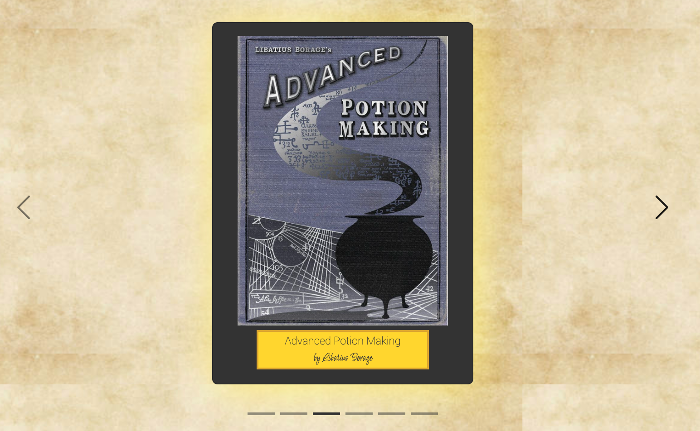
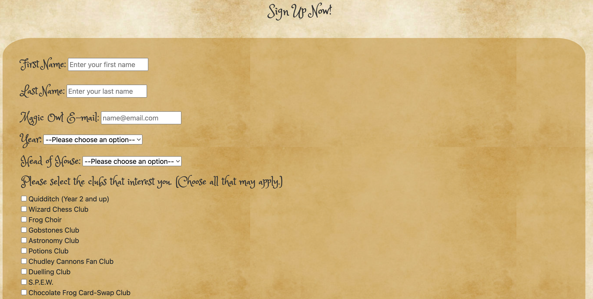

# Hogwarts School of Witchcraft and Wizardry Website

Welcome to the Hogwarts School Website, an online resource for students, parents and guardians of current and prospective Hogwarts students. The website has been inspired by JK Rowling's famous Harry Potter book series. The aim is to provide a fictional platform that serves as a hub of information for all things related to Hogwarts School of Witchcraft and Wizardry that any prospective or current Hogwarts student might deem useful.

It will be useful to the target audience as it will be welcoming new and current students to the school with a welcome message from the Headmaster, and will provide information about the school houses that play a vital role in school life. It will also provide the students and their families with information regarding reading lists for required texts for each year and a sign up sheet for extra-curricular activities.

A live version of the site can be viewed from [here.](https://ui.dev/amiresponsive?url=https://d3lyth.github.io/milestone-project-1)

Here is a mock-up image of the Hogwarts website, using the "Am I Responsive" site.


## UX

The design process started with some sketches of the website for mobile screens. Sketches were initially made on the Goodnotes App on the iPad.

<details>
<summary>Click here to view the Home Page sketch</summary>


</details>

<details>
<summary>Click here to view the Info Page sketch</summary>


</details>

<details>
<summary>Click here to view the Signup Page sketch</summary>


</details>

### Colour Scheme

The inspiration for the colours and colour scheme for the website was based on the Great Hall in Hogwarts Castle the colour of parchment (which is the main material used by students at Hogwarts for their class notes and letters sent by owls to others outside of the school) and the main colours of the crests used in for the four school houses.

The colours of the Great hall include browns, which represent the interior and the long house benches that pupils eat their meals by; golds, which represent drinking goblets and other other tableware, and wand-light.

- Brown: `#333`
- Gold: `#ffd700` - Was changed from back gold in deployment stage to improve accessibility and colour contrast.
- Gold (for logo): `#b59254`
- Bright Gold: `#daa520`
- Yellow Glow: `#fdec6e`

Adobe Color was used to create the colour palette [https://color.adobe.com/create/color-wheel].


- `#333` used for primary text on light background
- `#ffd700` used for text on dark background
- `#b59254` used for Hogwarts logo
- `#daa520` and #fdec6e used for on hover glow highlighting

The house colours (used mainly on the flip cards on the 'home page') are as follows:
- Griffindor - Maroon (`#800000`) and gold (`#fad700`)
- Ravenclaw - Dark blue (`##020247`) and bronze (`#c8986b`)
- Hufflepuff - Yellow (`#eed813`) and black (`#000000`)
- Slytherin - Green (`#015401`) and silver (`#eff5f2`)

### Typography

The fonts used for the website are listed below, and are all from Google Fonts.

Allura is a Google Font that was chosen as the Logo font for the School with cursive being the fallback font.

Princess Sofia is a Google Font that was chosen as a cursive text to give the main headings and titles of the site an old-fashioned, handwritten look to tie in with the Harry Potter theme.

Another google for that was used for the primary text of the website was another Google Font - 'Quicksand'. The back-up font is 'sans-serif'. Although this isn't an 'old-fashioned' cursive font, it was chosen for its readability as Princess Sofia as a small font was more difficult to read. 

Some other parts of the text used the Google Font 'Roboto'. This is also a sans-serif font, which is quite similar to 'Quicksand' in style. But is was used for parts of the site that required a substantial amount of text, but was still different to the primary text. It was used in places such as 'The Headmaster's Speech' and 'card information'.

The last Google Fonts used was 'Licorice' - this is seen on the book labels on the carousel.This font was chosen again for its handwritten look, with cursive being the fallback font.

- The standard 'cursive' font was used for the font in the logo - although other fonts were trialled, the cursive font looked the most suitable.

- [Princess Sofia](https://fonts.google.com/specimen/Princess+Sofia) was used for the primary headers and titles. The fallback font was 'cursive'.

- [Quicksand](https://fonts.google.com/specimen/Quicksand) was used for all other secondary text for its readability. The fallback font used was 'sans-serif'.

- [Roboto](https://fonts.google.com/specimen/Roboto) was used for all text that needed to stand out a bit. The fallback font used was 'sans-serif'.

- [Licorice](https://fonts.google.com/specimen/Licorice) was used for small detailing on the book labels found on the carousel. The fallback font was 'cursive'.

- [Font Awesome](https://fontawesome.com) icons were used throughout the site, such as the social media icons in the footer.

## User Stories

### New Site Users

- As a new Hogwarts Student, I would like to look up information about the house system, so that I can be prepared for the sorting ceremony.
- As a new Hogwarts Student, I would like to find information about book lists used in classes, so that I can find where to go and buy them and prepare for the year ahead.
- As a new Hogwarts student, I want to be able to access the Clubs page of the Hogwarts School website, so that I can choose my extracurricular clubs and submit my choices.
- As a new Hogwarts Student, I would like to find the links to the school's social media, so that I can keep up to date with any announcements.

### Returning Site Users

- As a returning Hogwarts Student, I would like to go back and sign up for more clubs for the following year, so that I can prepare for the year ahead.
- As a returning Hogwarts Student, I would like to find new book lists for the new school year, so that I can buy them and prepare for the new year.
- As a returning Hogwarts Student, I would like to be able to read Professor Dumbledore's welcome speech, so that I can be reminded of the message he gives the students every year.
- As a returning Hogwarts Student, I would like to fill in the permission slip for Hogsmede, so that I can make sure that the form is sent correctly.
- As a returning Hogwarts Student, I would like to find the links to the school's social media, so that I can keep up to date with any announcements.

### Site Admin

- As a site administrator, I should be able to navigate the website using the links, so that I can ensure that all pages and links are working as they should.
- As a site administrator, I should be able to manage club permissions, so that I can update the list of available clubs, add new clubs, or remove clubs as needed.
- As a site administrator, I should be able to manage house information on the Hogwarts School website, so that I can update and maintain accurate information about each house.
- As a site administrator, I should be able to manage book lists and required books for each year on the Hogwarts School website so that I can edit this on a yearly basis if the curriculum or required texts change.

## Wireframes

After the initial sketch, and to follow best practice, [Balsamiq](https://balsamiq.com/wireframes) was used to develop the wireframes for the three separate pages (each) for mobile screens, tablet screens and desktop screens.

### Home Page Wireframes

<details>
<summary>Click here to view the Home Page wireframes</summary>


</details>

### Information Page Wireframes

<details>
<summary>Click here to view the Information Page wireframes</summary>


</details>

### Clubs Page Wireframes

<details>
<summary>Click here to view the Clubs Page wireframes</summary>


</details>

## Features

### Existing Features

- **Navigation Bar with links**

    - The navigation bar includes the Hogwarts Crest (logo) and name on the left. This will appear on each page of the website. Clicking on the logo will ensure that the user returns to the home page each time. The links on the right allows the user to navigate to the different pages within the site.


- **FlipCards including House Information**

    - The flipcard feature shows the crest and colours of all the Hogwarts houses. On the main side the house crest is shown. Hovering on desktops (and pressing the flipcard on mobiles and tablets) will show the name of the house and give the history and main characteristincs of the houses. Houses are an integral part of the school, thereore it is important for users to find out information about the school houses.


- **Social Links**

    - The icons along the bottom will increase in size and glow when hovered upon. These are the links to all the various social media pages of Hogwarts School - Facebook, Instagram, Twitter and YouTube. All websites include information about social media and the links are found ont he bottom of each page within the website. This will help with the ease of use and users will know what to expect.


- **Burger Button Links (for smaller screens)**

    - The links to navigate to the other pages in the site is collapsed into a burger button with a drop down menu for smaller screens. This is to follow good practice and allow ease of use for users accessing teh website on smaller devices.


- **Book Cover Carousel**

    - The book cover carousel has been included to allow the users to have a bit of interactivity with the website. The carousels also allowss for the users to visualise what the books look like without it taking up a huge amount of space on the page. Users will be able to scroll through some examples of books using the prev/next buttons.



- **Sign Up Form**

    - The sign up form allows the students to choose the clubs they wish to join for the next school year. The form includes 3 input fields: first name, last name and e-mail address. The next two fields are dropdown fields that allows the user to choose their school year and their head of house. The next part of the form includes a list of clubs with checkboxes that students can choose (as many as they want) to indicate their choices. 



- **Permission Slip and Submit Button**

    - The last part of the form allows the parents of the user to use a dropdown menu to give permission (or not) for their child to be able to go off school grounds. Below this is the form submit button that submits the form and sends the user to a 'Thank you for signing up' page, in which they are able to navigate back to the home page.


### Future Features

The website could be further expanded in many ways.

- Uniform Feature
    - A carousel showcasing the school uniform, or even a possibility to be able to order a uniform could be included on a future version of the site.
- Virtual Tour Feature
    - A video of a tour of the school could be placed on the information page, or a tour of the various common rooms could be included. To make it more authentic, a password protected area could be set up so that only memebers of certain houses will be able to access.
- Further Information
    - More information could be included regarding staff members, classes, example timetables, subject options, careers advice, floor plan of the castle and term times could be included. 

## Tools & Technologies Used

- [HTML](https://en.wikipedia.org/wiki/HTML) used for the main site content.
- [CSS](https://en.wikipedia.org/wiki/CSS) used for the main site design and layout.
- [CSS Flexbox](https://www.w3schools.com/css/css3_flexbox.asp) used for an enhanced responsive layout.
- [Git](https://git-scm.com) used for version control. (`git add`, `git commit`, `git push`)
- [GitHub](https://github.com) used for secure online code storage.
- [GitHub Pages](https://pages.github.com) used for hosting the deployed front-end site.
- [Gitpod](https://gitpod.io) used as a cloud-based IDE for development.
- [Bootstrap](https://getbootstrap.com) used as the front-end CSS framework for modern responsiveness and pre-built components.

## Testing

For all testing, please refer to the [TESTING.md](TESTING.md) file.

## Deployment

The site was deployed to GitHub Pages. The steps to deploy are as follows:
- In the [GitHub repository](https://github.com/D3lyth/milestone-project-1), navigate to the Settings tab 
- From the source section drop-down menu, select the **Main** Branch, then click "Save".
- The page will be automatically refreshed with a detailed ribbon display to indicate the successful deployment.

The live link can be found [here](https://d3lyth.github.io/milestone-project-1)

### Local Deployment

This project can be cloned or forked in order to make a local copy on your own system.

#### Cloning

You can clone the repository by following these steps:

1. Go to the [GitHub repository](https://github.com/D3lyth/milestone-project-1) 
2. Locate the Code button above the list of files and click it 
3. Select if you prefer to clone using HTTPS, SSH, or GitHub CLI and click the copy button to copy the URL to your clipboard
4. Open Git Bash or Terminal
5. Change the current working directory to the one where you want the cloned directory
6. In your IDE Terminal, type the following command to clone my repository:
	- `git clone https://github.com/D3lyth/milestone-project-1.git`
7. Press Enter to create your local clone.

Alternatively, if using Gitpod, you can click below to create your own workspace using this repository.

[](https://gitpod.io/#https://github.com/D3lyth/milestone-project-1)

Please note that in order to directly open the project in Gitpod, you need to have the browser extension installed.
A tutorial on how to do that can be found [here](https://www.gitpod.io/docs/configure/user-settings/browser-extension).

#### Forking

By forking the GitHub Repository, we make a copy of the original repository on our GitHub account to view and/or make changes without affecting the original owner's repository.
You can fork this repository by using the following steps:

1. Log in to GitHub and locate the [GitHub Repository](https://github.com/D3lyth/milestone-project-1)
2. At the top of the Repository (not top of page) just above the "Settings" Button on the menu, locate the "Fork" Button.
3. Once clicked, you should now have a copy of the original repository in your own GitHub account!

### Local VS Deployment

Comparing Local vs live deployment, there doesn't seem to be any differences in the websites.

## Credits

### Content

Below is a list of some of the websites that I used to help completing the website.

The colour-changing heading code used was code that I had used previously on another project (credited in table below):

```css
h1 {animation: color-change 2s infinite;
}

@keyframes color-change {
  0% { color: #eeebf5; }
  25% { color: #5763e6; }
  50% { color: #e6ce57; }
  75% { color: #33ab3b; }
  100% { color: #b02328; }
}
```

| Source | Location | Notes |
| --- | --- | --- |
| [Markdown Builder](https://traveltimn.github.io/markdown-builder) | README and TESTING | tool to help generate the Markdown files |
| [Chris Beams](https://chris.beams.io/posts/git-commit) | version control | "How to Write a Git Commit Message" |
| [W3Schools](https://www.w3schools.com/howto/howto_js_topnav_responsive.asp) | entire site | responsive HTML/CSS/JS navbar |
| [W3Schools](https://www.w3schools.com/css/css3_variables.asp) | entire site | how to use CSS :root variables |
| [Flexbox Froggy](https://flexboxfroggy.com/) | entire site | modern responsive layouts |
| [Code Institute](https://learn.codeinstitute.net) | css Love Running | The idea for using a hero image on the homepage |
| [freeCodeCamp](https://www.freecodecamp.org/learn/2022/responsive-web-design/) | My project for the Certification task - Survey Form | css and keyframes for the colour-changing heading |
| [Stack Overflow](https://stackoverflow.com/questions/46249541/change-arrow-colors-in-bootstraps-carousel/49017805#49017805) | Used to troubleshoot changing the colour of the arrows in a bootstrap carousel |

### Media

The content was based on J.K. Rowling's famous Harry Potter Book series. The images and information were gathered from the following sites:

| Source | Location | Type | Notes |
| --- | --- | --- | --- |
| [Hogwarts Crest](https://i.pinimg.com/736x/04/bf/78/04bf788c531a977831b14dafcb15da5f.jpg) | entire site | image | Hogwarts crest on all pages |
| [Hogwarts Castle](https://encrypted-tbn2.gstatic.comimagesq=tbn:ANd9GcTvPB9wkhPxa1HaKZbn-6aGE41fqYdy5ReVFTQx73Ij_dmP-qHT) | home page | hero image | image of castle when site is opened |
| [Dumbledore Image](https://starwars-universe.fandom.com/wiki/Jorus_Sabaoth) | home page | image | Dumbledore's image for home page |
| [Griffindor Crest](https://www.pngwing.com/en/search?q=gryffindor) | home page | image | image for front of flip card |
| [Ravenclaw Crest](https://i.pinimg.com/736x/3a/cd/d1/3acdd106cae5bd733ad238aaba256c87.jpg) | home page | image | image for front of flip card |
| [Hufflepuff Crest](https://sgt-pokemon.neocities.org/Harry_Potter/hufflepuffcrestlargewoshad.png) | home page | image | image for front of flip card |
| [Slytherin Crest](https://s.clipartkey.com/mpngs/s/74-741705_slytherin-house-hogwarts-harry-potter-professor-severus-slytherin.png) | home page | image | image for front of flip card |
| [Parchment Paper Background](https://www.rawpixel.com/image/597215/aged-paper-texture) | entire site | background image | to make the backround look like paper |
| [A History of Magic Book Cover](https://harrypottershop.com/collections/mina-lima) | information page | image | book cover included on book carousel |
| [Advanced Transfiguration Book Cover](https://www.hollydunndesign.com/#/harry-potter-textbook-covers/) | information page | image | book cover included on book carousel |
| [Advanced Potion Making Book Cover](https://harrypotter.fandom.com/wiki/Sixth_year) | information page | image | book cover included on book carousel |
| [Unfogging the Future Book Cover]( https://harrypotter.fandom.com/ru/wiki/) | information page | image | book cover included on book carousel |
| [The Standard Book of Spells Book Cover](https://i.pinimg.com/originals/5f/f0/a0/5ff0a04d0dc284845ad99dc9bfb69c82.jpg) | information page | image | book cover included on book carousel |
| [Fantastic Beasts Book Cover](https://harrypotter.fandom.com/wiki/Fantastic_Beasts_and_Where_to_Find_Them) | information page | image | book cover included on book carousel |
| [Hogwarts Information for content](https://www.wizardingworld.com/) | entire site | information for content | Used to find information on clubs, houses, book lists |
| [Hogwarts Information for further content](https://harrypotter.fandom.com/wiki/Harry_Potter/) | entire site | information for content | Used to find information on clubs, houses, book lists |

The following sites were used to edit and compress the images:

| Source | Location | Type | Notes |
| --- | --- | --- | --- |
| [TinyPNG](https://tinypng.com) | entire site | image | tool for image compression |
| [PhotoPea](https://www.photopea.com) | entire site | image | tool for editing photos |

### Acknowledgements

- I would like to thank my Code Institute mentor, [Tim Nelson](https://github.com/TravelTimN) for their support throughout the development of this project - his feedback and encouragement has been invaluable.
- I would like to thank the [Code Institute](https://codeinstitute.net) tutor team for their assistance with troubleshooting and debugging some project issues.
- I would like to thank the [Code Institute Slack community](https://code-institute-room.slack.com) for the moral support; it kept me going during periods of self doubt and imposter syndrome.
- I would like to thank my husband (Rob), for believing in me, and allowing me to make this transition into software development and for testing out the website over and over again.
- I would like to thank Nathan Parry, our cohort lead at Code Institute for his continuous encouragement, offers of help and assistance with troubleshooting various aspects of the project.
- I would like to thank Iris Smok, our Cohort Facilitator for her continued support, the weekly stand-up updates and for keeping me on track.
