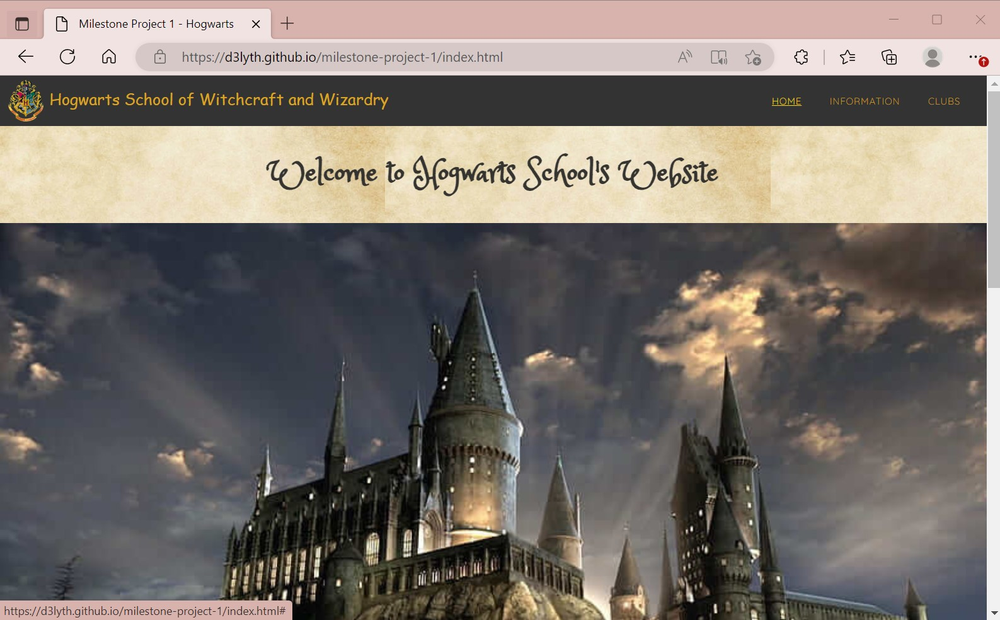
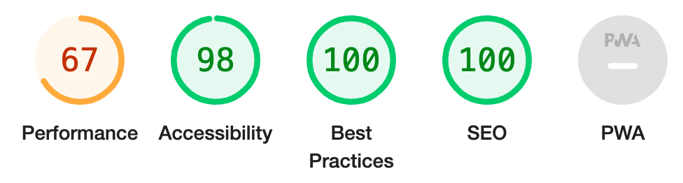
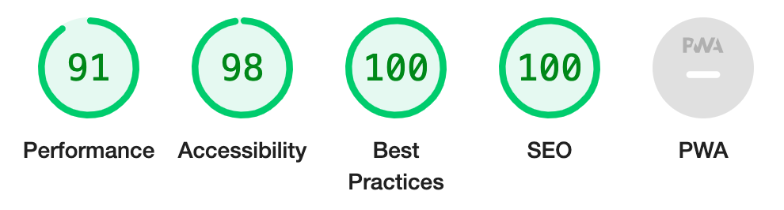

# Testing

Return back to the [README.md](README.md) file.

## Code Validation

### HTML

I have used the recommended [HTML W3C Validator](https://validator.w3.org) to validate all of my HTML files. I have validated using the live, deployed site using the live site links shown below.

| Page | W3C URL | Screenshot | Notes |
| --- | --- | --- | --- |
| Home | [W3C](https://validator.w3.org/nu/?doc=https%3A%2F%2FD3lyth.github.io%2Fmilestone-project-1%2Findex.html) |  | No errors: Img-fliud errors and duplicate ids found and fixed |
| Information | [W3C](https://validator.w3.org/nu/?doc=https%3A%2F%2Fd3lyth.github.io%2Fmilestone-project-1%2Finformation.html) |  | No errors: Img-fluid errors found and fixed |
| Clubs | [W3C](https://validator.w3.org/nu/?doc=https%3A%2F%2FD3lyth.github.io%2Fmilestone-project-1%2Fclubs.html) |  |No Errors, but warning for section (form) lacking h2-h6 headings  |
| Sign Up Complete | [W3C](https://validator.w3.org/nu/?doc=https%3A%2F%2FD3lyth.github.io%2Fmilestone-project-1%2Fsignupcomplete.html) |  | No Errors, but warning for section (form) lacking h2-h6 headings  |

### CSS

I have used the recommended [CSS Jigsaw Validator](https://jigsaw.w3.org/css-validator) to validate all of my CSS files. I copied and pasted the css code into the validator using this link (to ensure that it was only my code and no external libraries/frameworks were included): https://jigsaw.w3.org/css-validator/#validate_by_input

| File | Jigsaw URL | Screenshot | Notes |
| --- | --- | --- | --- |
| style.css | [Jigsaw](https://jigsaw.w3.org/css-validator/validator?uri=https%3A%2F%2FD3lyth.github.io%2Fmilestone-project-1) |  | Pass: No Errors. There were warnings, but these have come from the Bootstrap code. |

## Browser Compatibility

I've tested my deployed project on multiple browsers to check for compatibility issues.

| Browser | Screenshot | Notes |
| --- | --- | --- |
| Chrome |  | Works as expected |
| Firefox |  | Works as expected |
| Edge |  | Minor css differences and scaling issues |
| Safari |  | Works as expected |
| Brave |  | Works as expected |
| Opera |  | Works as expected|

## Responsiveness

I've tested my deployed project on multiple devices to check for responsiveness issues.

| Device | Screenshot | Notes |
| --- | --- | --- |
| Mobile (iPhone14) |   | Works as expected |
| Tablet (iPadAir) |    | Works as expected |
| Desktop (Macbook 13") |  | Works as expected |
| XL Monitor (DevTools) |  | Scaling starts to have minor issues - text is small|
| 4K Monitor (DevTools) |  | Noticeable scaling issues - cannot read the text |
| Galaxy Fold (DevTools) |  | Due to small screen, x-scrollbar comes into effect and some scaling issues|

## Lighthouse Audit
I've tested my deployed project using the Lighthouse Audit tool to check for any major issues.

| Page | Size | Screenshot | Notes |
| --- | --- | --- | --- |
| Home | Mobile |  | Slow response time due to large images |
| Home | Desktop |  | Slow response time due to large images |
| Information | Mobile |  | Some minor warnings |
| Information | Desktop |  | No issues |
| Clubs | Mobile |  | Slow response time due to large images |
| Clubs | Desktop |  | No issues |
| Sign Up Complete | Mobile |  | No issues |
| Sign Up Complete | Desktop |  | No issues |

## User Story Testing

| User Story | Screenshot |
| --- | --- |
| As a new site user, I would like to be able to navigate easily around the site, so that I can find what I need easily. This can be done clicking on the navigation links and the log will always take the user back to the homepage.|  |
| As a new site user, I would like to find out information about the school houses, so that I can interact with the site and prepare for the school year. Information about all houses can be found by clicking on the cards that rotate to show the information regarding the characteristics. Clicking ont these will allow users to rad up about the four houses. |  |
| As a new site user, I would like to be able to navigate to the school's various social links, so that I can keep up to date with all the annoucements and details regarding the school. The links at the bottom will send the user to various social media sites. The link have all been tested and open correctly in a new tab. |  |
| As a new and returning site user, I would like to be able to navigate the site on a smaller device, so that I can access the information on a mobile phone. The toggle button allows the user to be able to do this intuitively and without having to make the font too small. The toggle button has been tested on various screen sizes to allow for ease of navigation through the site. |  |
| As a new and returning site user, I would like to view the books that will be required to study at Hogwarts, so that I can then see what I'm looking for and what the books look like. A selection of the book covers can be scrolled through a carousel so that the user can view the book covers without too much scrolling and images overwhelming a space all at once. The carousel has been tested on various screen sizes and returns to the starts whenn all the books have been scrolled through. |  |
| As a new and returning site user, I would like to fill in a form to be able to join clubs without spending time filling out a lengthy sign-up, so that I can easily see which clubs are available at the school. The form has been tested so that each part has a input type. The form has been tested so that if the email address field does not include an "@" the form will ask the user to input again. The form has been tested so that if any of the required fields have not been copleted, the form will not be submitted and the required fiels must be filled. |  |
| As a returning site user, I should be able to navigate the site easily to find the sign-up form, so that I can come back and re-join clubs and fill in a permission slip - there is a clearly marked drop down menu to allow year 3 and above students to indicate permission for Hogsmede visits. The dropdown menu has been tested so that a 'do' or 'do not' option will need to be selected. |  |
| As a returning site user, I would like to be able to view a message after filling in the form, so that I can know that I have submitted it correctly. The submit button has been tested so that a 'Thank you for signing-up' page appears after pressing the sign-up button. |  |

## Bugs

- JS Uncaught ReferenceError: `foobar` is undefined/not defined

    

    - To fix this, I _____________________.

- JS `'let'` or `'const'` or `'template literal syntax'` or `'arrow function syntax (=>)'` is available in ES6 (use `'esversion: 11'`) or Mozilla JS extensions (use moz).

    

    - To fix this, I _____________________.

**Fixed Bugs**

All previously closed/fixed bugs can be tracked [here](https://github.com/D3lyth/milestone-project-1/issues?q=is%3Aissue+is%3Aclosed).

| Bug | Status |
| --- | --- |
| [JS Uncaught ReferenceError: `foobar` is undefined/not defined](https://github.com/D3lyth/milestone-project-1/issues/1) | Closed |
| [Python `'ModuleNotFoundError'` when trying to import module from imported package](https://github.com/D3lyth/milestone-project-1/issues/2) | Closed |
| [Django `TemplateDoesNotExist` at /appname/path appname/template_name.html](https://github.com/D3lyth/milestone-project-1/issues/3) | Closed |

**Open Issues**

Any remaining open issues can be tracked [here](https://github.com/D3lyth/milestone-project-1/issues).

| Bug | Status |
| --- | --- |
| [JS `'let'` or `'const'` or `'template literal syntax'` or `'arrow function syntax (=>)'` is available in ES6 (use `'esversion: 11'`) or Mozilla JS extensions (use moz).](https://github.com/D3lyth/milestone-project-1/issues/4) | Open |
| [Python `E501 line too long` (93 > 79 characters)](https://github.com/D3lyth/milestone-project-1/issues/5) | Open |

## Unfixed Bugs

- On devices smaller than 375px, the page starts to have `overflow-x` scrolling.

    

    - Attempted fix: I tried to add additional media queries to handle this, but things started becoming too small to read.

    - Attempted fix: I tried to adjust the terminal size, but it only resizes the actual terminal, not the allowable area for text.

- When validating HTML with a semantic `section` element, the validator warns about lacking a header `h2-h6`. This is acceptable.

    

    - Attempted fix: this is a known warning and acceptable, and my section doesn't require a header since it's dynamically added via JS.

Other than the bugs mentiobned above, there are no other remaining bugs that I am aware of.
