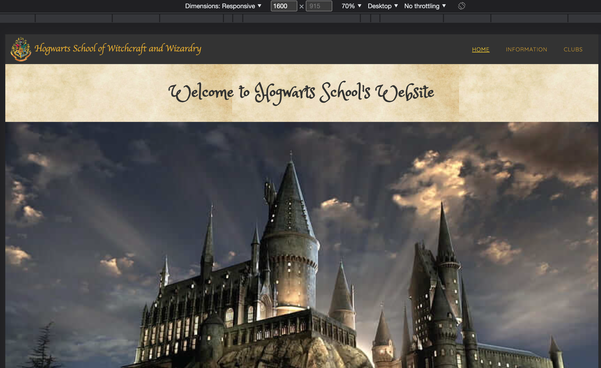

# Testing

Return back to the [README.md](README.md) file.

## Code Validation

### HTML

I have used the recommended [HTML W3C Validator](https://validator.w3.org) to validate all of my HTML files. I have validated using the live, deployed site using the live site links shown below.

- https://validator.w3.org/nu/?doc=https%3A%2F%2FD3lyth.github.io%2Fmilestone-project-1%2Findex.html
- https://validator.w3.org/nu/?doc=https%3A%2F%2FD3lyth.github.io%2Fmilestone-project-1%2Finformation.html
- https://validator.w3.org/nu/?doc=https%3A%2F%2FD3lyth.github.io%2Fmilestone-project-1%2Fclubs.html
- https://validator.w3.org/nu/?doc=https%3A%2F%2FD3lyth.github.io%2Fmilestone-project-1%2Fsignupcomplete.html

| Page | W3C URL | Screenshot | Notes |
| --- | --- | --- | --- |
| Home | [W3C](https://validator.w3.org/nu/?doc=https%3A%2F%2FD3lyth.github.io%2Fmilestone-project-1%2Findex.html) |  | Img-fliud errors and duplicate ids found and fixed |
| Information | [W3C](https://validator.w3.org/nu/?doc=https%3A%2F%2Fd3lyth.github.io%2Fmilestone-project-1%2Finformation.html) |  | Img-fluid errors found and fixed |
| Clubs | [W3C](https://validator.w3.org/nu/?doc=https%3A%2F%2FD3lyth.github.io%2Fmilestone-project-1%2Fclubs.html) |  |🔴 Pass: No Errors |
| Sign Up Complete | n/a |  | No errors (1 minor warning) |

### CSS

I have used the recommended [CSS Jigsaw Validator](https://jigsaw.w3.org/css-validator) to validate all of my CSS files. I copied and pasted the css code into the validator using this link (to ensure that it was only my code and no external libraries/frameworks were included): https://jigsaw.w3.org/css-validator/#validate_by_input

| File | Jigsaw URL | Screenshot | Notes |
| --- | --- | --- | --- |
| style.css | [Jigsaw](https://jigsaw.w3.org/css-validator/validator?uri=https%3A%2F%2FD3lyth.github.io%2Fmilestone-project-1) |  | Pass: No Errors. There were warnings, but these have come from the Bootstrap code. |

## Browser Compatibility

The testing of the live/deployed site is done on various browsers as listed below:

- [Chrome](https://www.google.com/chrome)
- [Firefox (Developer Edition)](https://www.mozilla.org/firefox/developer)
- [Edge](https://www.microsoft.com/edge)
- [Safari](https://support.apple.com/downloads/safari)
- [Brave](https://brave.com/download)
- [Opera](https://www.opera.com/download)

I've tested my deployed project on multiple browsers to check for compatibility issues.

| Browser | Screenshot | Notes |
| --- | --- | --- |
| Chrome |  | Works as expected |
| Firefox |  | Works as expected |
| Edge |  | Works as expected |
| Safari |  | Minor CSS differences |
| Brave |  | Works as expected |
| Opera |  | Minor differences |
| Internet Explorer |  | Does not work as expected |

## Responsiveness

I've tested my deployed project on multiple devices to check for responsiveness issues.

| Device | Screenshot | Notes |
| --- | --- | --- |
| Mobile (iPhone14) |   | Works as expected |
| Tablet (iPadAir) |    | Works as expected |
| Desktop (Macbook 13") |  | Works as expected |
| XL Monitor (DevTools) |  | Scaling starts to have minor issues - text is small|
| 4K Monitor (DevTools) |  | Noticeable scaling issues - cannot read the text |
| Galaxy Fold (DevTools) |  | Due to small screen, x-scrollbar comes into effect and some scaling issues|

## Lighthouse Audit
🔴🔴
I've tested my deployed project using the Lighthouse Audit tool to check for any major issues.

| Page | Size | Screenshot | Notes |
| --- | --- | --- | --- |
| Home | Mobile |  | Some minor warnings |
| Home | Desktop |  | Few warnings |
| Information | Mobile |  | Some minor warnings |
| Information | Desktop |  | Few warnings |
| Clubs | Mobile |  | Slow response time due to large images |
| Clubs | Desktop |  | Slow response time due to large images |
| Sign Up Complete | Mobile |  | Slow response time due to large images |
| Sign Up Complete | Desktop |  | Slow response time due to large images |

## User Story Testing
🔴🔴
| User Story | Screenshot |
| --- | --- |
| As a new site user, I would like to ____________, so that I can ____________. |  |
| As a new site user, I would like to ____________, so that I can ____________. |  |
| As a new site user, I would like to ____________, so that I can ____________. |  |
| As a returning site user, I would like to ____________, so that I can ____________. |  |
| As a returning site user, I would like to ____________, so that I can ____________. |  |
| As a returning site user, I would like to ____________, so that I can ____________. |  |
| As a site administrator, I should be able to ____________, so that I can ____________. |  |
| As a site administrator, I should be able to ____________, so that I can ____________. |  |
| As a site administrator, I should be able to ____________, so that I can ____________. |  |
| repeat for all remaining user stories | x |

## Bugs

- JS Uncaught ReferenceError: `foobar` is undefined/not defined

    

    - To fix this, I _____________________.

- JS `'let'` or `'const'` or `'template literal syntax'` or `'arrow function syntax (=>)'` is available in ES6 (use `'esversion: 11'`) or Mozilla JS extensions (use moz).

    

    - To fix this, I _____________________.

### GitHub **Issues**

⚠️⚠️⚠️⚠️⚠️ START OF NOTES (to be deleted) ⚠️⚠️⚠️⚠️⚠️

An improved way to manage bugs is to use the built-in **Issues** tracker on your GitHub repository.
To access your Issues, click on the "Issues" tab at the top of your repository.
Alternatively, use this link: https://github.com/D3lyth/milestone-project-1/issues

If using the Issues tracker for your bug management, you can simplify the documentation process.
Issues allow you to directly paste screenshots into the issue without having to first save the screenshot locally,
then uploading into your project.

You can add labels to your issues (`bug`), assign yourself as the owner, and add comments/updates as you progress with fixing the issue(s).

Once you've sorted the issue, you should then "Close" it.

When showcasing your bug tracking for assessment, you can use the following format:

🛑🛑🛑🛑🛑 END OF NOTES (to be deleted) 🛑🛑🛑🛑🛑

**Fixed Bugs**

All previously closed/fixed bugs can be tracked [here](https://github.com/D3lyth/milestone-project-1/issues?q=is%3Aissue+is%3Aclosed).

| Bug | Status |
| --- | --- |
| [JS Uncaught ReferenceError: `foobar` is undefined/not defined](https://github.com/D3lyth/milestone-project-1/issues/1) | Closed |
| [Python `'ModuleNotFoundError'` when trying to import module from imported package](https://github.com/D3lyth/milestone-project-1/issues/2) | Closed |
| [Django `TemplateDoesNotExist` at /appname/path appname/template_name.html](https://github.com/D3lyth/milestone-project-1/issues/3) | Closed |

**Open Issues**

Any remaining open issues can be tracked [here](https://github.com/D3lyth/milestone-project-1/issues).

| Bug | Status |
| --- | --- |
| [JS `'let'` or `'const'` or `'template literal syntax'` or `'arrow function syntax (=>)'` is available in ES6 (use `'esversion: 11'`) or Mozilla JS extensions (use moz).](https://github.com/D3lyth/milestone-project-1/issues/4) | Open |
| [Python `E501 line too long` (93 > 79 characters)](https://github.com/D3lyth/milestone-project-1/issues/5) | Open |

## Unfixed Bugs

⚠️⚠️⚠️⚠️⚠️ START OF NOTES (to be deleted) ⚠️⚠️⚠️⚠️⚠️

You will need to mention unfixed bugs and why they were not fixed.
This section should include shortcomings of the frameworks or technologies used.
Although time can be a big variable to consider, paucity of time and difficulty understanding
implementation is not a valid reason to leave bugs unfixed.

If you've identified any unfixed bugs, no matter how small, be sure to list them here.
It's better to be honest and list them, because if it's not documented and an assessor finds the issue,
they need to know whether or not you're aware of them as well, and why you've not corrected/fixed them.

Some examples:

🛑🛑🛑🛑🛑 END OF NOTES (to be deleted) 🛑🛑🛑🛑🛑

- On devices smaller than 375px, the page starts to have `overflow-x` scrolling.

    

    - Attempted fix: I tried to add additional media queries to handle this, but things started becoming too small to read.

    - Attempted fix: I tried to adjust the terminal size, but it only resizes the actual terminal, not the allowable area for text.

- When validating HTML with a semantic `section` element, the validator warns about lacking a header `h2-h6`. This is acceptable.

    

    - Attempted fix: this is a known warning and acceptable, and my section doesn't require a header since it's dynamically added via JS.

Other than the bugs mentiobned above, there are no other remaining bugs that I am aware of.
